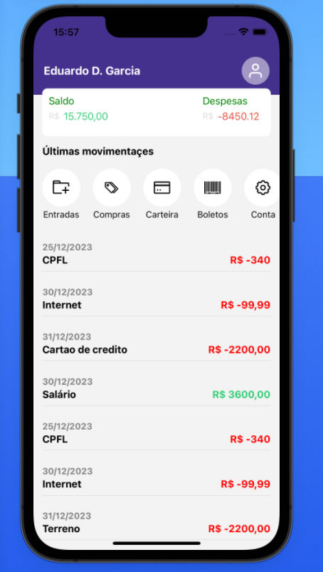

# App Gerenciador Financeiro Pessoal

## Tecnologias
React Native  
Expo Navigation 

## Framework
Expo

## How to install
If you are using yarn just type <code>yarn</code> otherwise you should be using npm so just run <code>npm install</code>.  
Then after the dependencies installed runs <code>expo start</code> or <code>npm run start</code>

## Contributor
Eduardo Diogo Garcia <eduardo.diogo@gmail.com>  
This is an opensource and free code.  
Feel free to clone and download it and enjoy your self !